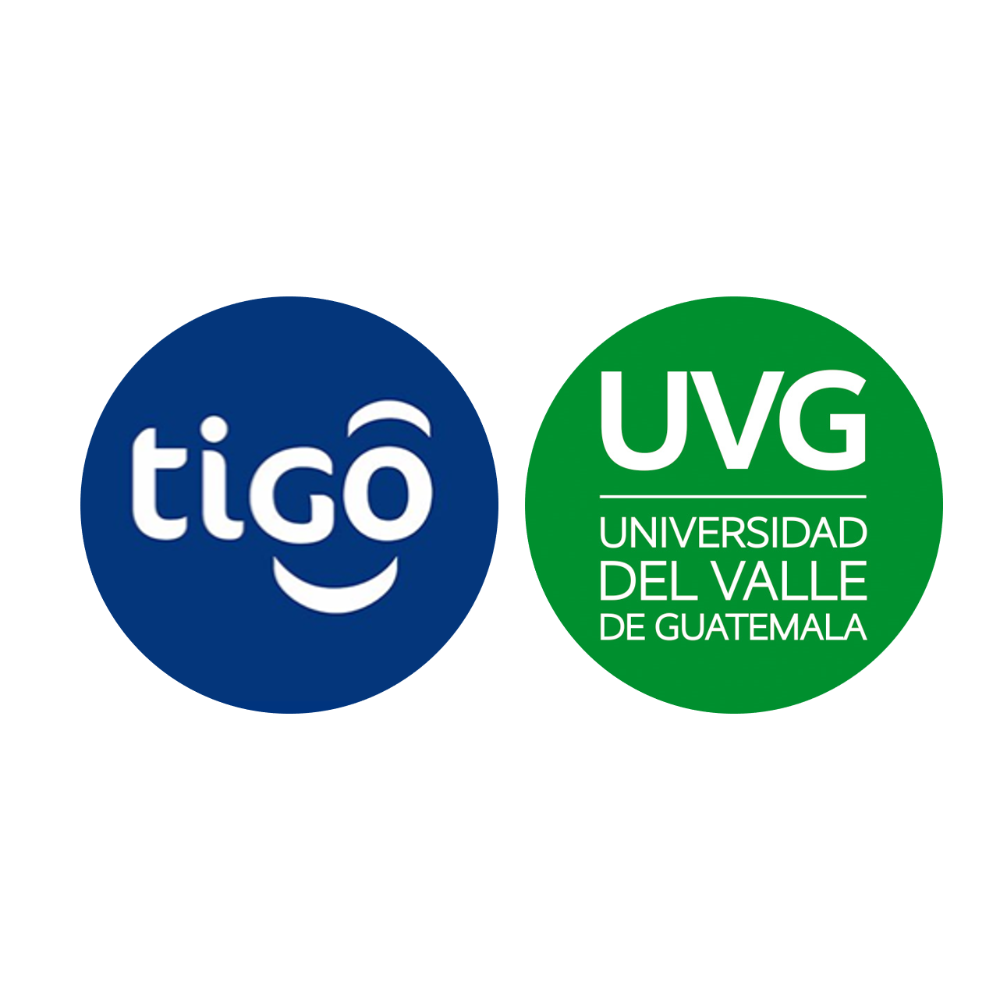

<div id="top"></div>
<!--
*** Thanks for checking out the Best-README-Template. If you have a suggestion
*** that would make this better, please fork the repo and create a pull request
*** or simply open an issue with the tag "enhancement".
*** Don't forget to give the project a star!
*** Thanks again! Now go create something AMAZING! :D
-->

<!-- PROJECT SHIELDS -->
<!--
*** I'm using markdown "reference style" links for readability.
*** Reference links are enclosed in brackets [ ] instead of parentheses ( ).
*** See the bottom of this document for the declaration of the reference variables
*** for contributors-url, forks-url, etc. This is an optional, concise syntax you may use.
*** https://www.markdownguide.org/basic-syntax/#reference-style-links
-->


<!-- PROJECT LOGO -->
<br />
<div align="center">
  <a href="https://github.com/UVG2022-TEAM/2022-NPL-tarea2-wiki_tokens">
    
  </a>

  <h3 align="center">Tarea 2 Wiki Tokens</h3>

  <p align="center">
    Tarea 2 de TEXT MINING & NATURAL LANGUAGE PROCESSING - SECCIÓN - 10 - 2022 - 1
    <br />
    <a href="https://github.com/UVG2022-TEAM/2022-NPL-tarea2-wiki_tokens"><strong>Explore the docs »</strong></a>
    <br />
    <br />
    <a href="https://github.com/UVG2022-TEAM/2022-NPL-tarea2-wiki_tokens">View Demo</a>
    ·
    <a href="https://github.com/UVG2022-TEAM/2022-NPL-tarea2-wiki_tokens/issues">Report Bug</a>
    ·
    <a href="https://github.com/UVG2022-TEAM/2022-NPL-tarea2-wiki_tokens/issues">Request Feature</a>
  </p>
</div>


<!-- ABOUT THE PROJECT -->
## Detalles de tarea

<!--  [![Product Name Screen Shot][product-screenshot]](https://example.com) -->

1. Hacer scrapping de wikipedia hasta llegar a 1 millón de tokens. 

2. Tokenización por separación por espacios como primer modelo simple de tokenización. 

3. Script de python que reciba un documento, tokenice, extraiga los tokens y su cantidad, así como y el vocabulario y su tamaño.

<p align="right">(<a href="#top">back to top</a>)</p>

### Desarrollado con

En esta sección incluimos el software necesario para instalar este proyecto.

* [Miniconda](https://docs.conda.io/en/latest/miniconda.html)
* [Anaconda](https://www.anaconda.com/)
* [Visual Studio Code](https://code.visualstudio.com/)
* [Github Desktop](https://desktop.github.com/)

<p align="right">(<a href="#top">back to top</a>)</p>


<!-- GETTING STARTED -->
## Comenzando ejecución

Clonamos el repositorio con ayuda de Github Destop. Posteriormente, es necesario tener Miniconda o Anaconda instalado para la instalación del enviroment. 

### Prerequisitos

Para cargar el environment configurado se tiene que leer el "environment.yml" con ello tendremos todas las librerías necesarias. Abrimos Anaconda Prompt y nos situamos en la carpeta principal del respositorio "2022-NPL-tarea1-scrapping". Ejecutar la siguiente linea de código:
* Anaconda Prompt
  ```sh
  conda env create -f environment.yml
  ```

Validamos que el enviroment "tarea2-wikitokens" esté instalado correctamente:

* Anaconda Prompt
  ```sh
  conda env list
  ```

Activamos el nuevo enviroment:

* Anaconda Prompt
  ```sh
  conda activate tarea2-wikitokens
  ```

_Para mayor detalle consultar la referencia de [como instalar un .yml en conda.](https://docs.conda.io/projects/conda/en/latest/user-guide/tasks/manage-environments.html#creating-an-environment-from-an-environment-yml-file)_ 

### Ejecución en IDE

Abrir su IDE de Python de preferencia, en nuestro caso usaremos Visual Studio Code. 

1. Abrir la carpeta "2022-NPL-tarea2_wiki_tokens"
2. *Tomamos como interprete Python 3.10.4 ('tarea2-wikitokens')
3. Abrimos la terminal y realizamos los `cd` necesarios para situarnos en la carpeta "...\2022-NPL-tarea2_wiki_tokens\wikipedia\wikipedia"
4. Situarnos en el archivo wiki_tokens.ipynb
5. Ejecutar los chunks del notebook wiki_tokens.ipynb
6. Obtenemos la gráfica _Vocabulario vs Tokens_

<p align="right">(<a href="#top">back to top</a>)</p>


<!-- CONTRIBUTING -->
## Contribuciones de integrantes

* Francisco Manjón: Scrappy wikipedia 
* William Chavarría: Data Cleansing & Tokenizacion 
* André Rodas: Enviroment prep, Data wrangling & Documentación
* Pablo Armas: QA, Documentación & Readme

<p align="right">(<a href="#top">back to top</a>)</p>

